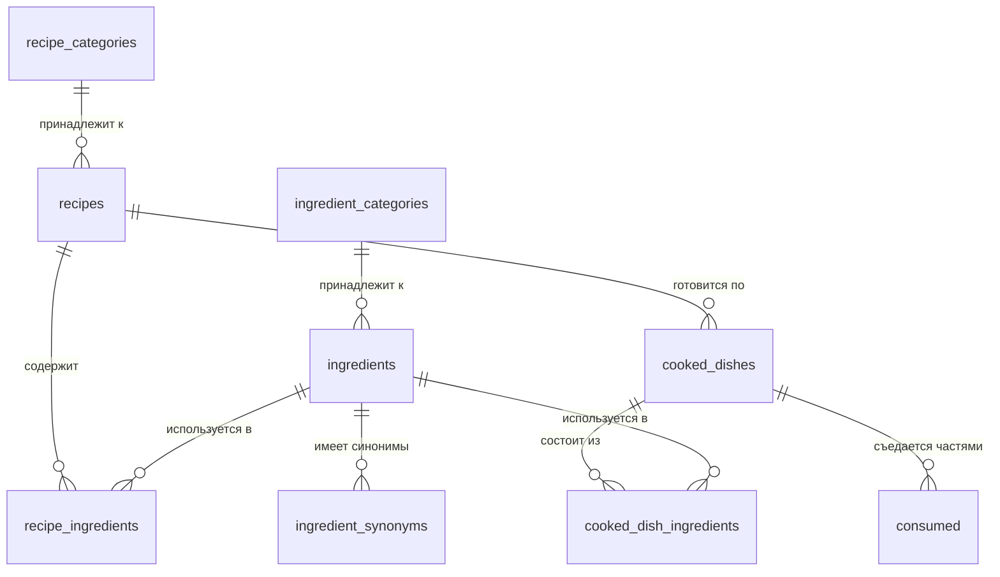

# Техническое задание: База данных системы учёта КБЖУ

## 📋 Содержание
1. [Общая информация](#общая-информация)
2. [Технологический стек](#технологический-стек)
3. [Структура проекта](#структура-проекта)
4. [Схема базы данных](#схема-базы-данных)
5. [Требования к реализации](#требования-к-реализации)
6. [Начальные данные](#начальные-данные)
7. [Тестирование](#тестирование)
8. [Документация](#документация)

---

## 🎯 Общая информация

### Цель проекта
Создать PostgreSQL базу данных для системы расчёта КБЖУ (калории, белки, жиры, углеводы) с поддержкой:
- Справочника ингредиентов с пищевой ценностью
- Рецептов для переиспользования
- Учёта приготовленных блюд с фактическим весом
- Истории потребления пищи
- Продвинутого поиска (полнотекстовый, нечёткий)

### Основные функции системы
1. Хранение базы ингредиентов с КБЖУ на 100г
2. Создание и переиспользование рецептов
3. Учёт приготовленных блюд с расчётом КБЖУ на 100г готового продукта
4. Трекинг съеденных порций (по граммам)
5. Статистика потребления по дням
6. Поиск ингредиентов с поддержкой синонимов и опечаток

### Особенности
- Локальное развёртывание через Docker
- Только SQL, никакого кода на других языках
- Полная нормализация данных
- Денормализация для производительности (предрасчитанные КБЖУ)
- Поддержка русского языка

---

## 🛠 Технологический стек

| Компонент | Технология | Версия |
|-----------|------------|--------|
| СУБД | PostgreSQL | 16+ |
| Контейнеризация | Docker | 20.10+ |
| Оркестрация | Docker Compose | 2.0+ |
| UI для БД | pgAdmin 4 | latest |

### Расширения PostgreSQL
- `pg_trgm` — trigram индексы для нечёткого поиска
- `fuzzystrmatch` — функции нечёткого сравнения строк
- `unaccent` — удаление диакритических знаков

---

## 📁 Структура проекта

```
nutrition-api/
├── README.md                       # Документация проекта
├── docker-compose.yml              # Конфигурация Docker
├── .env.example                    # Пример переменных окружения
├── .env                            # Переменные окружения (не коммитить!)
├── .gitignore                      # Игнорируемые файлы
│
├── init/                           # SQL скрипты инициализации (выполняются по порядку)
│   ├── 01_create_extensions.sql    # Подключение расширений PostgreSQL
│   ├── 02_create_tables.sql        # Создание таблиц
│   ├── 03_create_indexes.sql       # Создание индексов
│   ├── 04_create_triggers.sql      # Триггеры и функции
│   ├── 05_create_views.sql         # Представления (VIEW)
│   ├── 06_create_functions.sql     # Функции поиска и расчётов
│   └── 07_seed_data.sql            # Начальные данные
│
├── tests/                          # SQL тесты
│   ├── test_01_basic_crud.sql      # Базовые CRUD операции
│   ├── test_02_search.sql          # Тесты поиска
│   ├── test_03_calculations.sql    # Тесты расчётов КБЖУ
│   ├── test_04_triggers.sql        # Тесты триггеров
│   ├── test_05_soft_delete.sql     # Тесты soft delete
│   └── run_tests.sh                # Скрипт запуска тестов
│
└── docs/                           # Дополнительная документация
    ├── ER_DIAGRAM.md               # ER-диаграмма
    ├── API_QUERIES.md              # Примеры запросов
    ├── PERFORMANCE.md              # EXPLAIN ANALYZE для ключевых запросов
    └── MIGRATION_GUIDE.md          # Руководство по миграциям (на будущее)
```

---

## 🗄 Схема базы данных

### ER-диаграмма



### Описание таблиц

#### 1. Справочники категорий

**`ingredient_categories`** — категории ингредиентов
- `id` (PK) — идентификатор
- `name` (UK) — название (мясо, крупы, овощи)
- `description` — описание категории
- `sort_order` — порядок сортировки
- `created_at` — дата создания

**`recipe_categories`** — категории рецептов
- `id` (PK) — идентификатор
- `name` (UK) — название (суп, гарнир, основное)
- `description` — описание категории
- `sort_order` — порядок сортировки
- `created_at` — дата создания

#### 2. Ингредиенты

**`ingredients`** — справочник ингредиентов
- `id` (PK) — SERIAL
- `name` — TEXT NOT NULL, название (например, "Курица грудка")
- `name_normalized` (UK) — TEXT UNIQUE NOT NULL, нормализованное имя для поиска
- `category_id` (FK) — INTEGER NOT NULL, ссылка на ingredient_categories
- `calories` — NUMERIC(6,2) NOT NULL, калории на 100г
- `protein` — NUMERIC(5,2) NOT NULL, белки (г) на 100г
- `fat` — NUMERIC(5,2) NOT NULL, жиры (г) на 100г
- `carbs` — NUMERIC(5,2) NOT NULL, углеводы (г) на 100г
- `fiber` — NUMERIC(5,2) NOT NULL DEFAULT 0, клетчатка (г) на 100г
- `deleted_at` — TIMESTAMP WITH TIME ZONE, дата удаления (soft delete)
- `created_at` — TIMESTAMP WITH TIME ZONE NOT NULL DEFAULT NOW()

**Constraints:**
- `CHECK (calories >= 0 AND calories <= 9999.99)`
- `CHECK (protein >= 0 AND protein <= 100)`
- `CHECK (fat >= 0 AND fat <= 100)`
- `CHECK (carbs >= 0 AND carbs <= 100)`
- `CHECK (fiber >= 0 AND fiber <= 100)`
- `CHECK (protein + fat + carbs + fiber <= 100)` — сумма БЖУ не превышает 100г

**Индексы:**
- B-tree на category_id (FK)
- GIN trigram на name_normalized
- GIN полнотекстовый на to_tsvector('russian', name)
- Partial index: `WHERE deleted_at IS NULL` для активных записей

**`ingredient_synonyms`** — синонимы ингредиентов
- `id` (PK) — SERIAL
- `ingredient_id` (FK) — INTEGER NOT NULL, ссылка на ingredients
- `synonym` — TEXT UNIQUE NOT NULL, синоним (нормализуется автоматически)
- `created_at` — TIMESTAMP WITH TIME ZONE NOT NULL DEFAULT NOW()

**Индексы:**
- B-tree на ingredient_id (FK)
- GIN trigram на synonym

#### 3. Рецепты

**`recipes`** — шаблоны рецептов (пропорции ингредиентов)
- `id` (PK) — SERIAL
- `name` — TEXT UNIQUE NOT NULL, название рецепта
- `description` — TEXT, описание приготовления
- `category_id` (FK) — INTEGER, ссылка на recipe_categories
- `avg_cooked_weight` — NUMERIC(7,2), средний вес готового (г), автообновляется
- `times_cooked` — INTEGER NOT NULL DEFAULT 0, количество приготовлений (автообновляется)
- `deleted_at` — TIMESTAMP WITH TIME ZONE, дата удаления (soft delete)
- `created_at` — TIMESTAMP WITH TIME ZONE NOT NULL DEFAULT NOW()
- `updated_at` — TIMESTAMP WITH TIME ZONE NOT NULL DEFAULT NOW()

**Индексы:**
- B-tree на category_id (FK)
- Partial index: `WHERE deleted_at IS NULL`

**`recipe_ingredients`** — состав рецепта (шаблон)
- `id` (PK) — SERIAL
- `recipe_id` (FK) — INTEGER NOT NULL, ссылка на recipes
- `ingredient_id` (FK) — INTEGER NOT NULL, ссылка на ingredients
- `weight_grams` — NUMERIC(7,2) NOT NULL, вес в граммах
- `note` — TEXT, заметка (опционально)

**Constraints:**
- `UNIQUE(recipe_id, ingredient_id)` — один ингредиент раз в рецепте
- `CHECK (weight_grams >= 1 AND weight_grams <= 10000)` — от 1г до 10кг

**Индексы:**
- B-tree на recipe_id (FK)
- B-tree на ingredient_id (FK)

#### 4. Приготовленные блюда

**`cooked_dishes`** — приготовленные партии (фактические данные)
- `id` (PK) — SERIAL
- `recipe_id` (FK) — INTEGER, ссылка на recipes (NULL для разовых блюд без рецепта)
- `name` — TEXT NOT NULL, название блюда
- `raw_weight` — NUMERIC(7,2) NOT NULL, вес сырых ингредиентов (г), вводится вручную
- `cooked_weight` — NUMERIC(7,2) NOT NULL, фактический вес готового (г)
- `total_calories` — NUMERIC(8,2) NOT NULL, калории всей партии (автоматически)
- `total_protein` — NUMERIC(7,2) NOT NULL, белки (г) всей партии (автоматически)
- `total_fat` — NUMERIC(7,2) NOT NULL, жиры (г) всей партии (автоматически)
- `total_carbs` — NUMERIC(7,2) NOT NULL, углеводы (г) всей партии (автоматически)
- `deleted_at` — TIMESTAMP WITH TIME ZONE, дата удаления (soft delete)
- `cooked_at` — TIMESTAMP WITH TIME ZONE NOT NULL DEFAULT NOW()
- `notes` — TEXT, заметки

**Constraints:**
- `CHECK (raw_weight >= 1 AND raw_weight <= 10000)` — от 1г до 10кг
- `CHECK (cooked_weight >= 1 AND cooked_weight <= 10000)` — от 1г до 10кг
- `CHECK (total_calories >= 0)`
- `CHECK (total_protein >= 0)`
- `CHECK (total_fat >= 0)`
- `CHECK (total_carbs >= 0)`

**Индексы:**
- B-tree на recipe_id (FK)
- B-tree на cooked_at для фильтрации по дате
- Partial index: `WHERE deleted_at IS NULL`

**Примечание:** КБЖУ рассчитывается триггером на основе cooked_dish_ingredients

**`cooked_dish_ingredients`** — состав приготовленного блюда (снимок фактических ингредиентов)
- `id` (PK) — SERIAL
- `cooked_dish_id` (FK) — INTEGER NOT NULL, ссылка на cooked_dishes
- `ingredient_id` (FK) — INTEGER NOT NULL, ссылка на ingredients
- `weight_grams` — NUMERIC(7,2) NOT NULL, вес в граммах

**Constraints:**
- `UNIQUE(cooked_dish_id, ingredient_id)` — один ингредиент раз в блюде
- `CHECK (weight_grams >= 1 AND weight_grams <= 10000)` — от 1г до 10кг

**Индексы:**
- B-tree на cooked_dish_id (FK)
- B-tree на ingredient_id (FK)

**Примечание:** При INSERT/UPDATE/DELETE триггер пересчитывает КБЖУ родительского блюда. Изменение ингредиентов НЕ влияет на уже съеденные порции в consumed.

#### 5. Потребление

**`consumed`** — история съеденных порций (иммутабельные данные)
- `id` (PK) — SERIAL
- `cooked_dish_id` (FK) — INTEGER NOT NULL, ссылка на cooked_dishes
- `weight_grams` — NUMERIC(6,2) NOT NULL, вес съеденной порции (г)
- `calories` — NUMERIC(7,2) NOT NULL, калории порции (денормализовано)
- `protein` — NUMERIC(6,2) NOT NULL, белки (г) порции (денормализовано)
- `fat` — NUMERIC(6,2) NOT NULL, жиры (г) порции (денормализовано)
- `carbs` — NUMERIC(6,2) NOT NULL, углеводы (г) порции (денормализовано)
- `consumed_at` — TIMESTAMP WITH TIME ZONE NOT NULL DEFAULT NOW()
- `meal_type` — TEXT, тип приёма ('завтрак', 'обед', 'ужин', 'перекус' или NULL)

**Constraints:**
- `CHECK (weight_grams >= 1 AND weight_grams <= 1000)` — от 1г до 1кг (порция)
- `CHECK (calories >= 0)`
- `CHECK (protein >= 0)`
- `CHECK (fat >= 0)`
- `CHECK (carbs >= 0)`
- `CHECK (meal_type IN ('завтрак', 'обед', 'ужин', 'перекус') OR meal_type IS NULL)`

**Индексы:**
- B-tree на cooked_dish_id (FK)
- B-tree на consumed_at для фильтрации по дате и статистики
- Composite index на (consumed_at, meal_type) для дневной статистики

**Примечание:**
- КБЖУ рассчитывается триггером BEFORE INSERT на основе cooked_dishes
- Триггер автоматически урезает weight_grams если порция больше остатка блюда
- Данные иммутабельны — не меняются при изменении cooked_dish_ingredients

---

## 🔧 Требования к реализации

### 1. Docker Compose конфигурация

**Файл:** `docker-compose.yml`

Требования:
- PostgreSQL 16 (alpine образ для размера)
- Автоматическая инициализация из папки `init/`
- Персистентное хранилище данных
- Health check для PostgreSQL
- pgAdmin 4 для управления БД
- Конфигурация через переменные окружения

**Переменные окружения:** `.env`
```env
POSTGRES_DB=nutrition
POSTGRES_USER=nutrition_app
POSTGRES_PASSWORD=nutrition_secure_password
POSTGRES_PORT=5432

PGADMIN_EMAIL=admin@nutrition.local
PGADMIN_PASSWORD=admin
PGADMIN_PORT=5050
```

**Персистентность:**
- Named volume `postgres_data` для данных PostgreSQL
- Автоматическая инициализация при первом запуске из `/docker-entrypoint-initdb.d/`

### 2. SQL скрипты

#### `init/01_create_extensions.sql`
- Подключить расширения: `pg_trgm`, `fuzzystrmatch`, `unaccent`
- Создать схему `nutrition`
- Установить `search_path = nutrition, public`

#### `init/02_create_tables.sql`
**Требования:**
- Все таблицы в схеме `nutrition`
- Комментарии COMMENT ON TABLE/COLUMN для всех объектов
- Типы данных:
  - SERIAL для PK
  - TEXT для строк
  - NUMERIC(precision, scale) для чисел (см. спецификацию выше)
  - TIMESTAMP WITH TIME ZONE для дат
  - INTEGER для FK и счётчиков
- CHECK constraints для валидации диапазонов
- UNIQUE constraints где указано
- Foreign keys с `ON DELETE RESTRICT` (вместо CASCADE, т.к. используется soft delete)
- Поля `deleted_at` для ingredients, recipes, cooked_dishes

#### `init/03_create_indexes.sql`
**Обязательные индексы:**

1. **Foreign keys (B-tree):**
   - ingredients.category_id
   - recipes.category_id
   - recipe_ingredients.recipe_id, ingredient_id
   - cooked_dishes.recipe_id
   - cooked_dish_ingredients.cooked_dish_id, ingredient_id
   - consumed.cooked_dish_id
   - ingredient_synonyms.ingredient_id

2. **Поиск (GIN):**
   - `CREATE INDEX idx_ingredients_name_trgm ON ingredients USING gin(name_normalized gin_trgm_ops)`
   - `CREATE INDEX idx_ingredients_name_fts ON ingredients USING gin(to_tsvector('russian', name))`
   - `CREATE INDEX idx_synonyms_trgm ON ingredient_synonyms USING gin(synonym gin_trgm_ops)`

3. **Временные поля (B-tree):**
   - consumed.consumed_at
   - cooked_dishes.cooked_at
   - `CREATE INDEX idx_consumed_stats ON consumed(consumed_at, meal_type)` (composite)

4. **Partial indexes (для активных записей):**
   - `CREATE INDEX idx_ingredients_active ON ingredients(id) WHERE deleted_at IS NULL`
   - `CREATE INDEX idx_recipes_active ON recipes(id) WHERE deleted_at IS NULL`
   - `CREATE INDEX idx_cooked_dishes_active ON cooked_dishes(id) WHERE deleted_at IS NULL`

#### `init/04_create_triggers.sql`

**Триггеры и функции:**

1. **Нормализация имени ингредиента** (BEFORE INSERT/UPDATE на ingredients)
   - Функция: `normalize_ingredient_name()`
   - Действия:
     - `LOWER(NEW.name)` → lowercase
     - `REPLACE(name, 'ё', 'е')` → замена ё на е
     - `TRIM(REGEXP_REPLACE(name, '\s+', ' ', 'g'))` → удаление лишних пробелов
     - Результат в `NEW.name_normalized`

2. **Нормализация синонимов** (BEFORE INSERT/UPDATE на ingredient_synonyms)
   - Функция: `normalize_synonym()`
   - Та же логика что для name_normalized

3. **Расчёт КБЖУ блюда** (AFTER INSERT/UPDATE/DELETE на cooked_dish_ingredients)
   - Функция: `recalculate_dish_nutrition()`
   - Действия:
     - Суммировать КБЖУ всех ингредиентов (с учётом веса)
     - Обновить total_calories, total_protein, total_fat, total_carbs в cooked_dishes
   - Примечание: НЕ влияет на consumed (исторические данные)

4. **Расчёт КБЖУ порции** (BEFORE INSERT на consumed)
   - Функция: `calculate_consumed_nutrition()`
   - Действия:
     - Получить КБЖУ на 100г из cooked_dishes
     - Рассчитать КБЖУ порции: `(weight_grams / 100) * kbzhu_per_100g`
     - Проверить остаток блюда
     - Если `weight_grams > остаток`: урезать до остатка (автоматически)
     - Установить calories, protein, fat, carbs

5. **Автообновление статистики рецепта** (AFTER INSERT на cooked_dishes)
   - Функция: `update_recipe_stats()`
   - Действия (только если recipe_id NOT NULL):
     - `times_cooked = times_cooked + 1`
     - `avg_cooked_weight = AVG(cooked_weight)` для всех блюд по рецепту
     - `updated_at = NOW()`
   - Примечание: При DELETE cooked_dishes статистика НЕ пересчитывается

6. **Автообновление updated_at** (BEFORE UPDATE на recipes)
   - Функция: `update_updated_at()`
   - Действие: `NEW.updated_at = NOW()`

#### `init/05_create_views.sql`

**Два набора представлений: `*_active` (без deleted_at) и `*_all` (все записи)**

**1. Основные сущности:**
- `ingredients_active` / `ingredients_all` — ингредиенты с категориями
- `recipes_active` / `recipes_all` — рецепты с категориями
- `cooked_dishes_active` / `cooked_dishes_all` — блюда с рецептами

**2. Расчётные VIEW:**
- `recipe_nutrition` — теоретический КБЖУ рецепта на основе recipe_ingredients
  - Columns: recipe_id, recipe_name, total_calories, total_protein, total_fat, total_carbs, total_weight

- `cooked_dishes_per_100g` — КБЖУ на 100г готового блюда
  - Columns: cooked_dish_id, dish_name, calories_per_100g, protein_per_100g, fat_per_100g, carbs_per_100g
  - Formula: `(total_calories / cooked_weight) * 100`

- `remaining_dishes` — остаток в кастрюле (только активные)
  - Columns: cooked_dish_id, dish_name, cooked_weight, consumed_weight, remaining_weight
  - Condition: `WHERE remaining_weight > 0 AND deleted_at IS NULL`

- `daily_stats` — статистика потребления по дням
  - Columns: date, meal_type, total_calories, total_protein, total_fat, total_carbs, portions_count
  - Group by: `DATE(consumed_at), meal_type`

- `popular_recipes` — популярные рецепты (только активные)
  - Columns: recipe_id, recipe_name, times_cooked, avg_cooked_weight
  - Order by: `times_cooked DESC, updated_at DESC`

#### `init/06_create_functions.sql`

**Функции для API:**

**1. `search_ingredients(query TEXT, limit_count INT DEFAULT 10)`**
- **Возврат:** TABLE(ingredient_id, name, category, calories, protein, fat, carbs, relevance)
- **Алгоритм многоуровневого поиска:**
  1. Точное совпадение по name_normalized (relevance = 1.0)
  2. Точное совпадение по синонимам (relevance = 0.95)
  3. Prefix поиск: `name_normalized LIKE 'query%'` (relevance = 0.8)
  4. Полнотекстовый: `to_tsvector('russian', name) @@ plainto_tsquery('russian', query)` (relevance = 0.6)
  5. Trigram similarity: `similarity(name_normalized, query) >= 0.3` (relevance = similarity)
- **Условие:** `WHERE deleted_at IS NULL`
- **Сортировка:** `ORDER BY relevance DESC, name LIMIT limit_count`

**2. `calculate_dish_nutrition(dish_id INT)`**
- **Возврат:** JSON
- **Назначение:** Ручной пересчёт КБЖУ блюда (для проверки)
- **Структура:**
  ```json
  {
    "dish_id": 123,
    "calories": 1234.56,
    "protein": 89.12,
    "fat": 45.67,
    "carbs": 123.45,
    "ingredients_count": 5
  }
  ```

**3. `get_daily_summary(summary_date DATE)`**
- **Возврат:** JSON
- **Назначение:** Статистика за день
- **Структура:**
  ```json
  {
    "date": "2025-11-13",
    "total": {"calories": 2000, "protein": 120, "fat": 70, "carbs": 200},
    "by_meal": {
      "завтрак": {"calories": 500, "protein": 30, "fat": 20, "carbs": 50},
      "обед": {...},
      "ужин": {...},
      "перекус": {...}
    },
    "portions_count": 8
  }
  ```

**4. `soft_delete_ingredient(ingredient_id INT)`**
- **Возврат:** BOOLEAN
- **Действие:** Установить deleted_at = NOW() для ингредиента
- **Проверка:** Нельзя удалить если используется в активных рецептах/блюдах

**5. `soft_delete_recipe(recipe_id INT)`**
- **Возврат:** BOOLEAN
- **Действие:** Установить deleted_at = NOW() для рецепта

**6. `soft_delete_cooked_dish(dish_id INT)`**
- **Возврат:** BOOLEAN
- **Действие:** Установить deleted_at = NOW() для блюда
- **Проверка:** Нельзя удалить если есть несъеденный остаток

#### `init/07_seed_data.sql`

**Начальные данные для продуктивного использования:**

1. **10 категорий ингредиентов** (см. раздел "Начальные данные")
2. **9 категорий рецептов:**
   - Завтрак, Обед, Ужин, Перекус, Суп, Гарнир, Основное блюдо, Салат, Десерт

3. **50-70 базовых ингредиентов** с реальными КБЖУ:
   - Мясо и птица (курица, говядина, свинина, индейка)
   - Рыба и морепродукты
   - Крупы и злаки (гречка, рис, овсянка, киноа)
   - Овощи (картофель, капуста, морковь, лук, помидоры, огурцы, перец)
   - Фрукты и ягоды
   - Молочные продукты (молоко, творог, йогурт, сыр)
   - Яйца
   - Жиры и масла
   - Бобовые (фасоль, нут, чечевица)
   - Орехи и семена
   - Специи и приправы (низкокалорийные)

4. **Синонимы для популярных ингредиентов** (20-30 записей):
   - Примеры: "курица" → "куриная грудка", "куриное филе", "chicken"
   - "греча" → "гречка", "гречневая крупа"

5. **3-5 простых базовых рецептов:**
   - Гречка с курицей
   - Рис с овощами
   - Овсянка на молоке
   - Омлет с овощами
   - Куриная грудка с гречкой и салатом

### 3. Требования к качеству

#### Производительность
- Все FK должны иметь индексы
- Денормализация для часто запрашиваемых данных (КБЖУ)
- EXPLAIN ANALYZE для критичных запросов

#### Надёжность
- CHECK constraints для валидации данных
- NOT NULL где необходимо
- UNIQUE constraints для уникальности
- Транзакции для связанных операций

#### Поддерживаемость
- Комментарии к таблицам и колонкам
- Понятные имена объектов
- Версионирование схемы (комментарии с датой создания)

---

## 📦 Начальные данные

### Категории ингредиентов
```sql
INSERT INTO kbzhu.ingredient_categories (name, description, sort_order) VALUES
('мясо', 'Мясо, птица, субпродукты', 10),
('рыба', 'Рыба и морепродукты', 20),
('крупы', 'Каши, злаки, макароны', 30),
('овощи', 'Свежие и замороженные овощи', 40),
('фрукты', 'Свежие и сушёные фрукты', 50),
('молочное', 'Молоко, творог, сыры', 60),
('яйца', 'Куриные и перепелиные яйца', 70),
('жиры', 'Масла и жиры', 80),
('бобовые', 'Фасоль, нут, чечевица', 90),
('орехи', 'Орехи и семена', 100);
```

### Примеры ингредиентов
```sql
INSERT INTO kbzhu.ingredients (name, name_normalized, category_id, calories, protein, fat, carbs, fiber) VALUES
-- Мясо
('Курица грудка', 'курица грудка', 1, 110, 23.0, 1.2, 0, 0),
('Курица бедро', 'курица бедро', 1, 180, 18.0, 11.0, 0, 0),
('Говядина', 'говядина', 1, 187, 18.9, 12.4, 0, 0),

-- Крупы
('Гречка', 'гречка', 3, 123, 4.2, 1.1, 25.0, 2.0),
('Рис белый', 'рис белый', 3, 130, 2.7, 0.3, 28.2, 0.3),

-- Овощи
('Свекла', 'свекла', 4, 43, 1.6, 0.1, 9.6, 2.5),
('Капуста белокочанная', 'капуста белокочанная', 4, 28, 1.8, 0.1, 5.8, 2.0),
('Картофель', 'картофель', 4, 77, 2.0, 0.4, 16.3, 1.4),

-- Жиры
('Масло подсолнечное', 'масло подсолнечное', 8, 899, 0, 99.9, 0, 0);
```

### Примеры синонимов
```sql
INSERT INTO kbzhu.ingredient_synonyms (ingredient_id, synonym) VALUES
(1, 'курица'),
(1, 'куриная грудка'),
(1, 'филе куриное'),
(1, 'chicken breast'),
(4, 'греча'),
(4, 'гречневая крупа');
```

---

## 🧪 Тестирование

### test_01_basic_crud.sql
Тесты базовых операций:
- Вставка ингредиента
- Вставка категории
- Создание рецепта
- Добавление ингредиентов в рецепт
- Проверка constraints

### test_02_search.sql
Тесты поиска:
- Точный поиск
- Поиск с опечатками
- Поиск по синонимам
- Поиск по категории
- Полнотекстовый поиск

### test_03_calculations.sql
Тесты расчётов:
- Расчёт КБЖУ рецепта
- Расчёт КБЖУ на 100г готового
- Расчёт остатка в кастрюле
- Дневная статистика

### test_04_triggers.sql
Тесты триггеров:
- Нормализация имени ингредиента
- Нормализация синонимов
- Автоматический расчёт КБЖУ блюда
- Автоматический расчёт КБЖУ порции
- Автообновление статистики рецепта
- Проверка урезания порции до остатка

### test_05_soft_delete.sql
Тесты soft delete:
- Удаление ингредиента
- Удаление рецепта
- Удаление блюда
- Проверка VIEW (*_active не показывает удалённые)
- Проверка VIEW (*_all показывает все)
- Запрет удаления используемых ингредиентов
- Запрет удаления блюда с остатком

### Запуск тестов
```bash
cd tests
./run_tests.sh
```

Скрипт должен:
1. Подключиться к БД
2. Запустить каждый тест-файл по порядку
3. Вывести результаты (PASS/FAIL)
4. Откатить изменения (BEGIN/ROLLBACK для изоляции)

---

## 📖 Документация

### README.md
Должен содержать:
1. Описание проекта
2. Быстрый старт (docker-compose up)
3. Структура БД (ссылка на ER-диаграмму)
4. Примеры запросов
5. Инструкции по развёртыванию
6. Troubleshooting

### ER_DIAGRAM.md
- Mermaid диаграмма
- Описание связей
- Описание таблиц

### API_QUERIES.md
Примеры SQL запросов для:
- Поиска ингредиентов (`search_ingredients()`)
- Создания рецепта с ингредиентами
- Приготовления блюда (INSERT в cooked_dishes + cooked_dish_ingredients)
- Учёта съеденного (INSERT в consumed)
- Получения статистики (`get_daily_summary()`, VIEW daily_stats)
- Просмотра остатков (VIEW remaining_dishes)
- Soft delete операций
- Работы с VIEW (*_active, *_all)

### PERFORMANCE.md
Документация производительности:
- EXPLAIN ANALYZE для `search_ingredients()` с разными запросами
- EXPLAIN ANALYZE для VIEW daily_stats с диапазоном дат
- EXPLAIN ANALYZE для JOIN в cooked_dishes_per_100g
- Рекомендации по индексам
- Статистика размера таблиц (pg_size_pretty)

---

## ✅ Критерии приёмки

### Обязательные требования
- ✅ Проект запускается через `docker-compose up -d`
- ✅ Все таблицы создаются автоматически с правильными типами данных
- ✅ Все constraints (CHECK, UNIQUE, FK) работают
- ✅ Начальные данные загружаются (50-70 ингредиентов, синонимы, рецепты)
- ✅ pgAdmin доступен на localhost:5050
- ✅ Все VIEW работают (*_active, *_all, расчётные)
- ✅ Все триггеры работают (нормализация, расчёты КБЖУ, статистика)
- ✅ Поиск с опечатками работает (trigram similarity >= 0.3)
- ✅ Soft delete работает (функции + VIEW)
- ✅ Тесты проходят успешно (включая test_05_soft_delete)
- ✅ Документация заполнена (README, ER_DIAGRAM, API_QUERIES, PERFORMANCE)

### Дополнительные требования
- ✅ Комментарии COMMENT ON к таблицам и колонкам
- ✅ Индексы для всех FK
- ✅ Partial indexes для deleted_at IS NULL
- ✅ GIN индексы для поиска (trigram, full-text)
- ✅ EXPLAIN ANALYZE в docs/PERFORMANCE.md
- ✅ Примеры использования в README и API_QUERIES.md
- ✅ Все числовые поля с правильной precision (NUMERIC)
- ✅ Функции soft_delete_* с проверками

---

## 🚀 Этапы реализации

### Этап 1: Инфраструктура (1-2 часа)

**Цель:** Подготовить окружение для разработки

**Задачи:**
1. **Создать структуру проекта:**
   ```bash
   mkdir -p nutrition-api/{init,tests,docs}
   touch nutrition-api/{README.md,docker-compose.yml,.env.example,.gitignore}
   ```

2. **Настроить .gitignore:**
   ```
   .env
   *.log
   .DS_Store
   ```

3. **Создать docker-compose.yml:**
   - Сервис PostgreSQL 16 (alpine)
   - Volume: postgres_data (named volume)
   - Маппинг init/ → /docker-entrypoint-initdb.d/
   - Health check для Postgres
   - Сервис pgAdmin 4
   - Networks для изоляции

4. **Создать .env.example и .env:**
   - Скопировать из ТЗ (раздел "Переменные окружения")
   - Заменить пароли на безопасные

5. **Проверить запуск:**
   ```bash
   docker-compose up -d
   docker-compose ps  # проверить статус
   docker-compose logs postgres  # проверить логи
   ```

**Критерий завершения:** PostgreSQL и pgAdmin запущены, доступны на портах 5432 и 5050

---

### Этап 2: Схема БД — Таблицы (2-3 часа)

**Цель:** Создать базовую структуру БД

**Задачи:**

1. **init/01_create_extensions.sql (15 мин):**
   ```sql
   CREATE EXTENSION IF NOT EXISTS pg_trgm;
   CREATE EXTENSION IF NOT EXISTS fuzzystrmatch;
   CREATE EXTENSION IF NOT EXISTS unaccent;
   CREATE SCHEMA IF NOT EXISTS nutrition;
   SET search_path = nutrition, public;
   ```

2. **init/02_create_tables.sql (1.5-2 часа):**
   - Создать таблицы в порядке зависимостей:
     1. ingredient_categories
     2. recipe_categories
     3. ingredients (с deleted_at, constraints)
     4. ingredient_synonyms
     5. recipes (с deleted_at, constraints)
     6. recipe_ingredients
     7. cooked_dishes (с deleted_at, constraints)
     8. cooked_dish_ingredients
     9. consumed (constraints на meal_type, weight)

   - Для КАЖДОЙ таблицы:
     - Добавить COMMENT ON TABLE
     - Добавить COMMENT ON COLUMN для всех колонок
     - Проверить все constraints из ТЗ
     - Проверить типы данных (NUMERIC precision)

3. **Проверка (30 мин):**
   ```sql
   -- Подключиться через pgAdmin или psql
   \dt nutrition.*  -- список таблиц
   \d+ nutrition.ingredients  -- структура таблицы
   -- Попробовать INSERT с нарушением constraints
   ```

**Критерий завершения:** Все 9 таблиц созданы, constraints работают

---

### Этап 3: Индексы и триггеры (2-3 часа)

**Цель:** Добавить производительность и автоматизацию

**Задачи:**

1. **init/03_create_indexes.sql (1 час):**
   - B-tree индексы на все FK (8 индексов)
   - GIN trigram на ingredients.name_normalized
   - GIN trigram на ingredient_synonyms.synonym
   - GIN full-text на ingredients.name
   - B-tree на consumed.consumed_at
   - Composite на consumed(consumed_at, meal_type)
   - B-tree на cooked_dishes.cooked_at
   - 3 Partial indexes (WHERE deleted_at IS NULL)

   **Проверка:** `\di nutrition.*` — список индексов

2. **init/04_create_triggers.sql (1.5-2 часа):**

   **Функции и триггеры:**

   a) **normalize_ingredient_name()** + триггер
   ```sql
   CREATE OR REPLACE FUNCTION nutrition.normalize_ingredient_name()
   RETURNS TRIGGER AS $$
   BEGIN
     NEW.name_normalized := TRIM(
       REGEXP_REPLACE(
         REPLACE(LOWER(NEW.name), 'ё', 'е'),
         '\s+', ' ', 'g'
       )
     );
     RETURN NEW;
   END;
   $$ LANGUAGE plpgsql;

   CREATE TRIGGER trg_normalize_ingredient_name
   BEFORE INSERT OR UPDATE ON nutrition.ingredients
   FOR EACH ROW EXECUTE FUNCTION nutrition.normalize_ingredient_name();
   ```

   b) **normalize_synonym()** + триггер (аналогично)

   c) **recalculate_dish_nutrition()** + триггер
   - AFTER INSERT/UPDATE/DELETE на cooked_dish_ingredients
   - Суммировать КБЖУ всех ингредиентов
   - UPDATE cooked_dishes SET total_*

   d) **calculate_consumed_nutrition()** + триггер
   - BEFORE INSERT на consumed
   - Рассчитать КБЖУ порции
   - Проверить остаток, урезать если нужно

   e) **update_recipe_stats()** + триггер
   - AFTER INSERT на cooked_dishes
   - Обновить times_cooked, avg_cooked_weight

   f) **update_updated_at()** + триггер
   - BEFORE UPDATE на recipes

   **Проверка:** Вставить тестовые данные, проверить автоматические расчёты

**Критерий завершения:** Все индексы и триггеры работают

---

### Этап 4: VIEW и функции (2-3 часа)

**Цель:** Создать удобные интерфейсы для работы с данными

**Задачи:**

1. **init/05_create_views.sql (1-1.5 часа):**

   **Создать VIEW в порядке:**
   1. ingredients_active / ingredients_all
   2. recipes_active / recipes_all
   3. cooked_dishes_active / cooked_dishes_all
   4. recipe_nutrition (JOIN recipe_ingredients + ingredients)
   5. cooked_dishes_per_100g (расчёт КБЖУ на 100г)
   6. remaining_dishes (с подзапросом SUM consumed)
   7. daily_stats (GROUP BY DATE, meal_type)
   8. popular_recipes (ORDER BY times_cooked)

   **Проверка:** `SELECT * FROM nutrition.remaining_dishes;`

2. **init/06_create_functions.sql (1-1.5 часа):**

   **Функции:**
   1. `search_ingredients(TEXT, INT)` — многоуровневый поиск
   2. `calculate_dish_nutrition(INT)` — ручной расчёт
   3. `get_daily_summary(DATE)` — JSON статистика
   4. `soft_delete_ingredient(INT)` — с проверкой использования
   5. `soft_delete_recipe(INT)`
   6. `soft_delete_cooked_dish(INT)` — с проверкой остатка

   **Проверка:**
   ```sql
   SELECT * FROM nutrition.search_ingredients('курица', 5);
   SELECT nutrition.get_daily_summary('2025-11-13');
   ```

**Критерий завершения:** Все VIEW и функции работают, возвращают данные

---

### Этап 5: Начальные данные (2-3 часа)

**Цель:** Заполнить БД реальными данными для использования

**Задачи:**

1. **init/07_seed_data.sql:**

   **Структура файла:**
   ```sql
   -- 1. Категории ингредиентов (10 записей)
   INSERT INTO nutrition.ingredient_categories ...

   -- 2. Категории рецептов (9 записей)
   INSERT INTO nutrition.recipe_categories ...

   -- 3. Ингредиенты (50-70 записей)
   -- Группировать по категориям для удобства
   -- Мясо и птица (8-10)
   -- Рыба (5-7)
   -- Крупы (6-8)
   -- Овощи (12-15)
   -- Фрукты (8-10)
   -- Молочное (6-8)
   -- Яйца (2-3)
   -- Жиры (4-5)
   -- Бобовые (4-5)
   -- Орехи (4-5)

   -- 4. Синонимы (20-30 записей)
   -- Для популярных ингредиентов

   -- 5. Рецепты (3-5 записей)
   -- Простые базовые рецепты

   -- 6. Ингредиенты рецептов
   -- Для каждого рецепта
   ```

   **Источники КБЖУ:** https://calorizator.ru, USDA FoodData Central

   **Примеры рецептов:**
   1. Гречка с курицей (гречка 100г, курица грудка 150г, масло 5г)
   2. Овсянка на молоке (овсянка 50г, молоко 200г)
   3. Омлет (яйца 2шт, молоко 50г, масло 5г)

2. **Проверка:**
   ```sql
   SELECT COUNT(*) FROM nutrition.ingredients_active;  -- 50-70
   SELECT * FROM nutrition.search_ingredients('кур', 10);
   SELECT * FROM nutrition.recipes_active;
   ```

**Критерий завершения:** 50-70 ингредиентов, синонимы, 3-5 рецептов загружены

---

### Этап 6: Тестирование (2-3 часа)

**Цель:** Проверить всю функциональность

**Задачи:**

1. **tests/test_01_basic_crud.sql (30 мин):**
   - INSERT/SELECT/UPDATE для всех таблиц
   - Проверка constraints (должны упасть с ошибкой)

2. **tests/test_02_search.sql (30 мин):**
   - Точный поиск
   - Поиск с опечатками (similarity)
   - Поиск по синонимам
   - Полнотекстовый поиск

3. **tests/test_03_calculations.sql (30 мин):**
   - Создать блюдо, проверить автоматический расчёт КБЖУ
   - Съесть порцию, проверить КБЖУ
   - Проверить VIEW cooked_dishes_per_100g
   - Проверить VIEW remaining_dishes
   - Проверить daily_stats

4. **tests/test_04_triggers.sql (30 мин):**
   - Нормализация имени
   - Урезание порции до остатка
   - Статистика рецепта

5. **tests/test_05_soft_delete.sql (30 мин):**
   - Удалить ингредиент, проверить VIEW
   - Попытка удалить используемый (должна упасть)
   - Удалить блюдо с остатком (должна упасть)

6. **tests/run_tests.sh (30 мин):**
   ```bash
   #!/bin/bash
   set -e

   PGHOST=localhost
   PGPORT=5432
   PGUSER=nutrition_app
   PGPASSWORD=nutrition_secure_password
   PGDATABASE=nutrition

   for test in tests/test_*.sql; do
     echo "Running $test..."
     psql -h $PGHOST -U $PGUSER -d $PGDATABASE -f $test
     echo "✓ $test passed"
   done
   ```

**Критерий завершения:** Все тесты проходят без ошибок

---

### Этап 7: Документация (2-3 часа)

**Цель:** Создать полную документацию проекта

**Задачи:**

1. **README.md (1 час):**
   - Описание проекта
   - Быстрый старт (docker-compose команды)
   - Структура БД (ссылка на ER_DIAGRAM.md)
   - Примеры использования
   - Troubleshooting

2. **docs/ER_DIAGRAM.md (30 мин):**
   - Mermaid диаграмма из ТЗ
   - Описание всех связей
   - Таблица с описанием таблиц

3. **docs/API_QUERIES.md (1 час):**
   - Примеры всех основных операций
   - Поиск, создание, учёт, статистика
   - SQL запросы с комментариями

4. **docs/PERFORMANCE.md (30 мин):**
   - EXPLAIN ANALYZE для search_ingredients
   - EXPLAIN ANALYZE для daily_stats
   - Рекомендации по оптимизации

**Критерий завершения:** Вся документация заполнена, примеры работают

---

### Этап 8: Финальная проверка (1 час)

**Задачи:**
1. Пересоздать БД с нуля: `docker-compose down -v && docker-compose up -d`
2. Проверить все критерии приёмки
3. Запустить все тесты
4. Проверить документацию
5. Создать резервную копию:
   ```bash
   docker exec nutrition-postgres pg_dump -U nutrition_app nutrition > backup.sql
   ```

---

## 📊 Общая оценка времени

| Этап | Время | Приоритет |
|------|-------|-----------|
| 1. Инфраструктура | 1-2 ч | Высокий |
| 2. Таблицы | 2-3 ч | Высокий |
| 3. Индексы и триггеры | 2-3 ч | Высокий |
| 4. VIEW и функции | 2-3 ч | Высокий |
| 5. Начальные данные | 2-3 ч | Средний |
| 6. Тестирование | 2-3 ч | Высокий |
| 7. Документация | 2-3 ч | Средний |
| 8. Финальная проверка | 1 ч | Высокий |
| **ИТОГО** | **14-21 ч** | |

## 🎯 Рекомендуемый порядок выполнения

**День 1 (4-6 часов):**
- Этап 1: Инфраструктура
- Этап 2: Таблицы
- Начало Этапа 3: Индексы

**День 2 (4-6 часов):**
- Завершение Этапа 3: Триггеры
- Этап 4: VIEW и функции

**День 3 (3-5 часов):**
- Этап 5: Начальные данные
- Этап 6: Тестирование

**День 4 (3-4 часа):**
- Этап 7: Документация
- Этап 8: Финальная проверка

---

## 📝 Примечания

### Особенности PostgreSQL
- Используется схема `nutrition` для изоляции объектов
- NUMERIC вместо FLOAT для точности расчётов КБЖУ
- TIMESTAMP WITH TIME ZONE для всех дат
- Русская локаль для полнотекстового поиска (`'russian'`)
- Пользователь БД: `nutrition_app` (не root)

### Производительность
- Денормализация КБЖУ в cooked_dishes и consumed для скорости чтения
- GIN индексы для быстрого поиска (trigram, full-text)
- Partial indexes для фильтрации активных записей (WHERE deleted_at IS NULL)
- Composite index на (consumed_at, meal_type) для статистики
- Документация производительности: `docs/PERFORMANCE.md` с EXPLAIN ANALYZE

### Безопасность
- Один пользователь `nutrition_app` с полными правами на схему `nutrition`
- В будущем: разделение на роли (readonly, app)
- Переменные окружения в .env (не коммитить в git)

### Масштабирование (будущие улучшения)
- Партиционирование таблицы `consumed` по дате (при росте >1M записей)
- Архивирование старых данных (>1 года) в отдельные таблицы
- Регулярный VACUUM ANALYZE
- Добавление многопользовательности (users table, RLS)

### Ключевые архитектурные решения

**1. Soft Delete вместо CASCADE:**
- ingredients, recipes, cooked_dishes имеют `deleted_at`
- Foreign keys с `ON DELETE RESTRICT`
- Два набора VIEW: `*_active` и `*_all`

**2. Денормализация данных:**
- КБЖУ хранится в cooked_dishes (рассчитывается триггерами)
- КБЖУ порций хранится в consumed (иммутабельно)
- Изменение ингредиентов НЕ влияет на исторические данные

**3. Рецепты как шаблоны:**
- Рецепт = пропорции ингредиентов
- При приготовлении можно изменить состав
- Пользователь вручную добавляет ингредиенты в cooked_dish_ingredients

**4. Автоматические расчёты:**
- Триггеры рассчитывают КБЖУ блюд при изменении ингредиентов
- Триггер автоматически урезает порцию если съедается больше остатка
- Статистика рецептов обновляется только при INSERT (не при DELETE)

**5. Ограничения на вес:**
- Ингредиенты и блюда: 1г - 10кг
- Порции: 1г - 1кг
- raw_weight вводится вручную (может отличаться от суммы ингредиентов)

**6. Типы приёма пищи:**
- meal_type: 'завтрак', 'обед', 'ужин', 'перекус' или NULL
- CHECK constraint для валидации

**7. Concurrent access:**
- Игнорируется для MVP (один пользователь)
- В будущем: добавить locking или optimistic concurrency

---

## 📞 Контакты

При возникновении вопросов или предложений:
- Создать issue в репозитории
- Обратиться к документации PostgreSQL
- Проверить логи: `docker-compose logs postgres`

---

**Версия документа:** 1.0  
**Дата создания:** 2025-11-13  
**Автор:** Claude (Anthropic)
