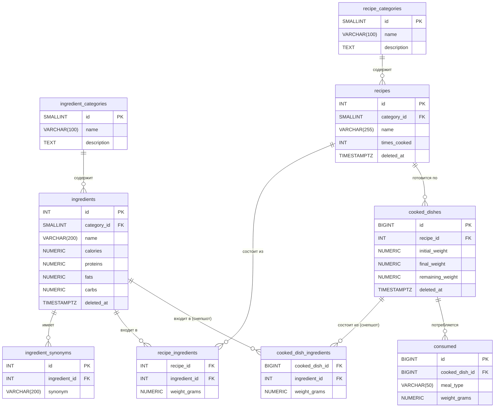

# ER Диаграмма базы данных

Ниже представлена Entity-Relationship диаграмма для базы данных `nutrition`.

## Mermaid диаграмма

## Описание таблиц и связей

- **ingredient_categories**: Справочник категорий для ингредиентов (например, "Мясо", "Овощи").
- **recipe_categories**: Справочник категорий для рецептов (например, "Завтраки", "Супы").
- **ingredients**: Основной справочник ингредиентов с их КБЖУ на 100г.
    - Связан с `ingredient_categories` по `category_id`.
- **ingredient_synonyms**: Синонимы для ингредиентов для улучшения поиска.
    - Связан с `ingredients` по `ingredient_id`.
- **recipes**: Рецепты блюд.
    - Связан с `recipe_categories` по `category_id`.
- **recipe_ingredients**: Таблица-связка, показывающая, какие ингредиенты и в каком количестве (в граммах) входят в состав рецепта.
    - Связана с `recipes` и `ingredients`.
- **cooked_dishes**: Таблица фактов. Запись здесь означает, что было приготовлено конкретное блюдо по рецепту.
    - Связана с `recipes`.
- **cooked_dish_ingredients**: Снепшот состава приготовленного блюда. Хранит точный состав и КБЖУ ингредиентов на момент приготовления.
    - Связана с `cooked_dishes` и `ingredients`.
- **consumed**: Таблица фактов. Запись здесь означает, что была съедена порция приготовленного блюда.
    - Связана с `cooked_dishes`.
